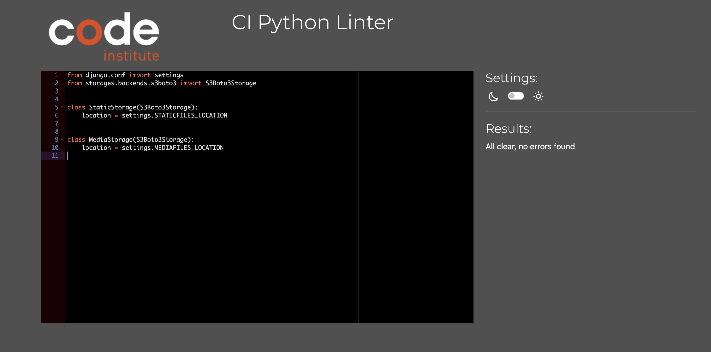
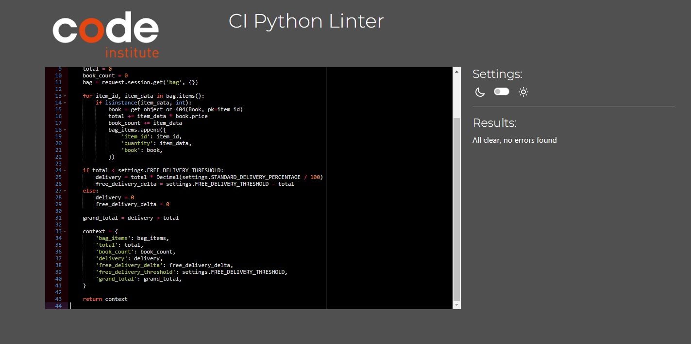
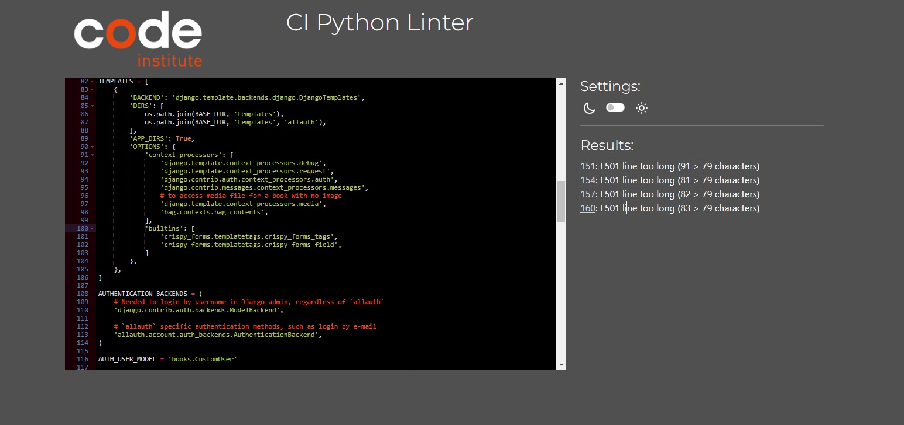
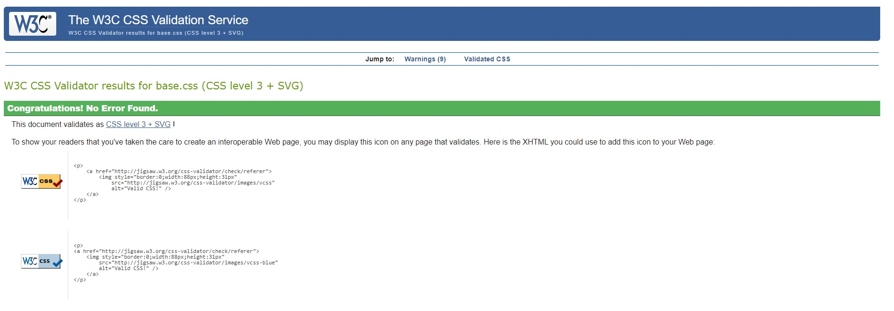
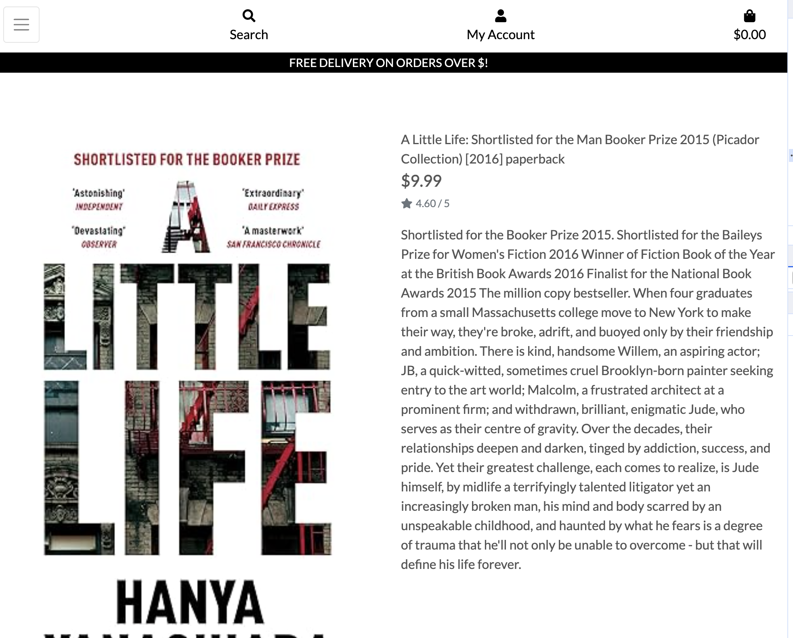
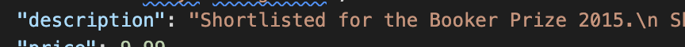

# BOOKZONE

A web application that enables users to buy second-hand books.

Visit the live site: [Bookzone](https://bookzone-dbc6fd65e384.herokuapp.com/)

## CONTENTS

- [AUTOMATED TESTING](#AUTOMATED-TESTING)
  - [Python Linter](#Python-Linter)
  - [Lighthouse](#Lighthouse)
- [MANUAL TESTING](#MANUAL-TESTING)
  - [Testing User Stories](#Testing-User-Stories)
  - [Full Testing](#Full-Testing)
- [BUG TRACKER](#BUG-TRACKER)
  - [Solved Bugs](#Solved-Bugs)
  - [Known Bugs](#known-Bugs)

---

Manual testing was carried out as soon as the project started using exploratory testing techniques and a list of bugs was identified and placed in a table to tackle.
At the same time as building the web, it was tested before moving to another steps and checking no major issues were found.
Afterwards, formal test cases were developed and executed.
Automated testing was carried out at a later stage using validators and all errors were fixed, it was checked that all user goals are met and after this, a test case table was created.

## AUTOMATED TESTING

### Python Linter

I used [Python Linter - Pep8CI](https://pep8ci.herokuapp.com/) to test python code, most errors were fixed which were related to spacing or lines length.

Some long line errors remained due to the impossibility of splitting up lines of code that would stop working otherwise or in build django code for example some lines at setting.py

### Lighthouse

I used Lighthouse within the Chrome Developer Tools to test the performance, accessibility, best practices and SEO of the website.

#### Desktop Results

##### Home
  

##### Books
  

##### Sing up
  

##### Login
  

+*

#### Mobile Results

##### Home
  

##### Books
Examples of lighthouse results are as follows:

  

##### Sing up
  

##### Login
  

---
### Jigsaw CSS Validator

I used [Jigsaw CSS Validator](https://jigsaw.w3.org/css-validator/) to test styles.css and found errors, only some minor warnings.

---
### W3 Html Validator

I used [W3 Html Validator](https://validator.w3.org/) to test all html pages and found no issues

---
## MANUAL TESTING

### Testing User Stories

#### 1A: As a user, I want to see a navigation menu so I can easily access all the content  
* **Acceptance Criteria:** A site user should always have access to the navigation menu so he can easily switch between pages at any time.
* **Summary:** 
    -When a user visits the website he can easily see the navigation menu at the top of the page; 
    -Even if switching the pages, the menu is always present at the top and indicates what page is currently active; 
       *By testing all these features, it can be affirmed that the user story is accomplished.* 
* **Outcome:** Pass or Fail

#### 1B: As a user, I want to see relevant information about the shop and books 
* **Acceptance Criteria:** A site user should be able to see relevant information about the shop and books.
* **Summary:**   
-When a user first visits the website, they are redirected to the *Home* page and an appealing cover is displayed, that ensures the user knows what the page at first sight;
-The cover also displays information about the welcome with name and slogan of the store;
-"About us" is a section on the *Home* page that describes the store and another image of the books

By testing all these features, it can be affirmed that the user story is accomplished.
* **Outcome:** Pass or Fail

#### 1C: As a user, I want the website to have a nice and intuitive design that will match the bookstore's theme
* **Acceptance Criteria:**  A site user should be able to access the content through an attractive design that would make him want to return to it anytime.
* **Summary:** 
    -When a user first visits the website he is redirected to *Home page* where the first impression is created when noticing the well-chosen fonts chosen for the navbar, title and slogan, as well as the cover image 
    -The colours of the website were tested to match the contrast requirements and all the colours chosen were generated from the colours' palette of the background cover 
    -Throughout the site there are elements created to help the user have a better experience when when navigating through the content 
    -On the Home suggest to the user to Register or Login to enjoy all the features of the website; 
    -The user gets button popup every time he performs an action such as Registering, Signing In/Signing Out  

    
    *By testing all these features, it can be affirmed that the user story is accomplished.* 
* **Outcome:** Pass or Fail 

### USER REGISTRATION/AUTENTHICATION
#### 2A: As a user, I want to be able to register on the website
* **Acceptance Criteria:** A site user should be able to create an account by filling in a form on the website.   
* **Summary:** 
    -There is a Register page that provides a form with email and password for the user to fill in; 
    -When the user submits the form a new entry is created in the Users table; 
    -A success message is displayed with the message "Logged in as..." that confirms to the user that he has been registered successfully.  

    *By testing all these features, it can be affirmed that the user story is accomplished.*  
* **Outcome:** Pass or Fail

#### 2B: As a user, I want to be able to authenticate using only email and password
* **Acceptance Criteria:** A site user should be able to authenticate at any time with email and password.
* **Summary:** 
    -There is a Login page that provides a form with email and password to be filled; 
    -The authentication form has a "Remember me" checkbox that will keep the user logged in; 
    -A success alert is displayed with the message "Logged in as..." that confirms to the user that he has been logged in successfully.  

    *By testing all these features, it can be affirmed that the user story is accomplished.*  
* **Outcome:** Pass or Fail

#### 2C: As a user, I want to be able to logout at any time
* **Acceptance Criteria:** A site user should be able to exit current account at any time.
* **Summary:**    
    -There is a Logout modal that can be triggered when clicking on the hyperlink in the navbar. The modal is implemented as part of defensive programming; 
    -The logout modal asks the user again if he wishes to exit the current account; 
    -A success button message is displayed with the message "You have signed out" that confirms to the user that he has been successfully logged out.  
    
    *By testing all these features, it can be affirmed that the user story is accomplished.*  
* **Outcome:** Pass or Fail

### BOOKS
#### 3A: As a logged-in user, I want to be able to find the available books to buy and list any books I have to sell
* **Acceptance Criteria:** A logged user should be provided with a clear list of items  
* **Summary:**  
    -There is a books page that can be accessed only by authenticated users, considering that all the entries must have the current user as the author; 
    -The books sections appear successive only after the previous ones are validated; 
    -The first section contains inputs for details, for the user to fill in; 
    -The validation of these values is very strict to prevent errors when generating the tables section. The following rules are being checked:
    * All the fields must be filled. 

    - If the validation is complete, and the user submits the form, a successful feedback in a form of a button message is provided 

    *By testing all these features, it can be affirmed that the user story is accomplished.*  
* **Outcome:** Pass or Fail

#### 3B: As a logged in user, I want to be able to edit or delete my books
* **Acceptance Criteria:** A logged in user should be provided a way to edit or delete a book if he no longer wishes to keep it. 
* **Summary:** 
    -In the Book listing page, the user is presented with all the books information. 
    -All the field information can be updated via an 'edit' button. 
    -Books can also be deleted via a 'delete' button. 

    *By testing all these features, it can be affirmed that the user story is accomplished.*  
* **Outcome:** Pass or Fail

### USER PROFILE
#### 4A: As a logged-in user, I want to create a a list of books to sell or buy
* **Acceptance Criteria:** A logged in user should be able to create a list of items
* **Summary:** 
    -A logged user should be able to enter a book 
    -Text should be able to be entered for the book description 
    -An image of the book can be added 

#### 4B: As a logged-in user, I want to view a list of my books
* **Acceptance Criteria:** A logged in user should be able to see a list of items 
* **Summary:** 
    -A logged user should be provided with a clear list of books 
    -The list should contain no text bleeding issues, corruptions or overlaps 
    -The images should display correctly 

    *By testing all these features, it can be affirmed that the user story is accomplished.*  
* **Outcome:** Pass or Fail

#### 4C: As a logged-in user, I want to be able to edit my books
* **Acceptance Criteria:** A logged in user should be able to edit their books 
* **Summary:** 
    -A logged can edit books by pressing a button 
    -A confirmation message should be displayed 
    -A success message should be displayed when finishing editing 

    *By testing all these features, it can be affirmed that the user story is accomplished.*  
* **Outcome:** Pass or Fail

#### 4D: As a logged-in user, I want to be able to delete my books
* **Acceptance Criteria:** A logged in user should be able to delete the entries
* **Summary:** 
    -A logged user can delete the entries by pressing a button 
    -A confirmation message should be displayed 
    -A success message should be displayed when finishing editing 

    *By testing all these features, it can be affirmed that the user story is accomplished.*  
* **Outcome:** Pass or Fail

### ADMIN MANAGE BOOKS
#### 5A: As a logged in admin member, I want to see the listings
* **Acceptance Criteria:** A logged in admin member should be able to see all the listing from all the users via admin panel   
* **Summary:** 
    -There is a *Manage Books* page with all the boos are visible only for logged-in admin members; 
    -The page displays all the books 
    -The books are listed correctly 

    *By testing all these features, it can be affirmed that the user story is accomplished.*  
* **Outcome:** Pass or Fail

#### 5B: As a logged-in admin member, I want to be able to filter books
* **Acceptance Criteria:** A logged in admin member should be able to filter books
* **Summary:** 
    -Filter option is available 
    -The items can be sorted correctly 
    -Different options for filtering 

    *By testing all these features, it can be affirmed that the user story is accomplished.*  
* **Outcome:** Pass or Fail

### CONTACT
#### 6A: As a user, I want to see the store contact details
* **Acceptance Criteria:** A site user should be provided information about the store contact details
* **Summary:**   
    -There is a section called "Where to find us" visible to any type of user 
    -The section displays the relevant information 
    -The section has a simple and attractive design and the information is clear.  

     *By testing all these features, it can be affirmed that the user story is accomplished.*  
* **Outcome:** Pass or Fail

### Full Testing

Full testing was performed on the following devices:

- Desktop:
  - Custom Gaming computer (Raven) with 2 screens set up 24 inches and Windows OS
- Laptop:
  - Mac book Pro 2023 14 inches screen and Mac OS & Mac monitor 27 inches.
- Tablet:
  - iPad 9th Gen.
- Android Mobile Devices:
  - Samsung Galaxy S20
  - Samsung Galaxy A50

Each device tested the site using the following browsers:

- Google Chrome
- Safari
- Firefox

### Functionality Test Cases

Comprehensive testing has been conducted to ensure that all website functionalities are working as intended, providing users with a reliable and enjoyable browsing experience.

| Functionality | What's being tested | Result |
|------|-------------|--------|
| Registration | A new user can create an account successfully. | Pass |
|  | The website displays an appropriate error message with hint when validation fails. | Pass |
|  | The website displays an appropriate message if link is invalid or token expired | Pass |
|  | User is signed in automatically when click confirm button | Pass |
| Admin Panel | Admin can login to admin panel. | Pass |
|  | Admin can add, edit and delete books. | Pass |
|  | Admin can add edit and delete menu items. | Pass |
|  | Admin can add and delete guests. | Pass |
|  | Admin can delete users. | Pass |
|  | Admin panel can be accessed by user | Pass |
|Login | A registered user can log in successfully. | Pass |
|  | The website displays an appropriate error message when a user enters an incorrect email or password. | Pass |
|  | A logged-in user can sign out successfully. | Pass |
|  | The website displays an appropriate error message when a user enters invalid data (e.g., date before current day, not allowed charset). | Pass |
|  | A user cannot edit or delete another user's profile | Pass |
|Books CRUD | Verify that a logged-in user can create, edit delete his own books. | Pass |
|  | Confirmation message is displayed when changes are saved | Pass |
|  | User is asked for confirmation before deleting books| Pass |
|  | Click on delete confirmation button deletes books | Pass  |
|  | A user can delete own books | Pass |
|  | Only authenticated users can book reservations | Pass |
|  | Confirmation message is displayed when a book is updated or deleted | Pass |
|Menu| A logged-in admin can add, edit or delete books | Pass |

---

## BUG TRACKER

### Solved Bugs

| ID  | CLASS | FEATURE/SECTION                 | SUMMARY                                                                                                                                                                                                                            | STEPS TO REPRODUCE                                                                                                                                                                           | ACTUAL RESULT                                                               | EXPECTED RESULT                                 | ACTION                                                                                                                                                                                                                                                                                                                                                                                                                                                                                                    | STATUS                          |
| --- | ----- | ----------------------- | -------------------------------------------------------------------------------------------------------------------------------------------------------------------------------------------------------------------------------------- | -------------------------------------------------------------------------------------------------------------------------------------------------------------------------------------------- | --------------------------------------------------------------------------- | ----------------------------------------------- | --------------------------------------------------------------------------------------------------------------------------------------------------------------------------------------------------------------------------------------------------------------------------------------------------------------------------------------------------------------------------------------------------------------------------------------------------------------------------------------------------------- | ------------------------------- |
| 1   | C     | Text Display |Line breaks not taking effect  | Go to the website > Click on any book to see the description > Observe the issue with the line breaks not being displayed     |The text where a line break is expected it is showing all in one the same line instead  |Please ensure that a line break is added where is expected  |Added the following code to the book_detail.html template | FIXED|

### Known Bugs

Known bugs here
